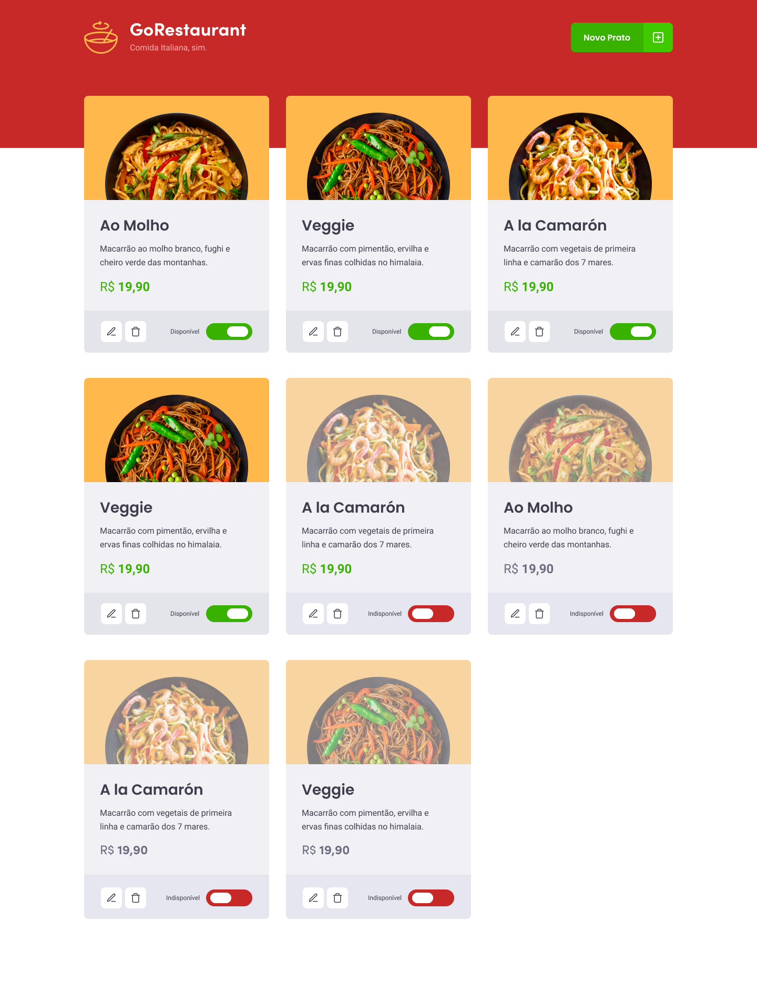

  

## Layout

  

# GoRestaurant 🍝
Este repositório é referente ao desafio 'CRUD React' do Bootcamp GoStack 11.0, da Rocketseat.

# Proposta
Este projeto é um estudo em React para treinar funções básicas de uma aplicação, tais como o CRUD (Create, Read, Update and Delete).
Para tornar o desafio mais complexo, também foi introduzido o isolamento de componentes que executam cada uma das operações e
a definição de tipos mais complexos, utilizando funções como propriedades entre os componentes.

# Tecnologias Utilizadas
React  
React Modal  
Styled-Components  
Jest   
React Icons  
Typescript 

# Testes
Esse projeto utiliza Jest para realizar os testes E2E.
Para inicializar todos os testes já prepardos, utilize <code> yarn test </code>.

# Como obter esse repositório?
Para obter esse projeto, siga os passos:
1. Clone esse repositório utilizando <code>git clone</code>.
2. Rode o comando <code> yarn </code> na raíz da pasta do projeto clonado para baixar as dependências.
3. Rode <code>json-server server.json -p 3333</code> na raíz da pasta do projeto para inicializar a Fake API.
4. Rode <code> yarn start </code> na raíz da pasta do projeto para inicializar o servidor.
